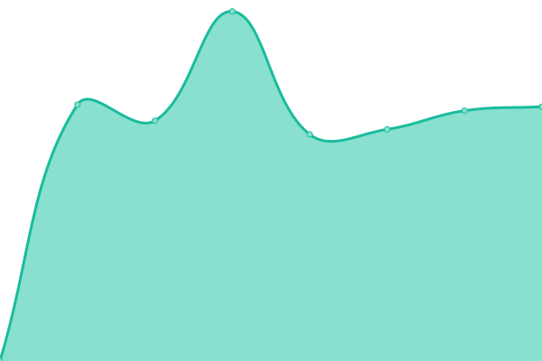
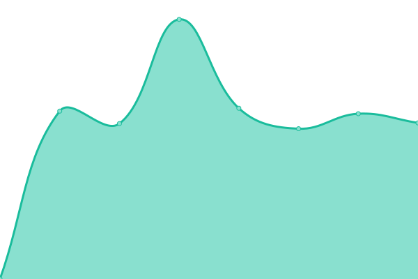
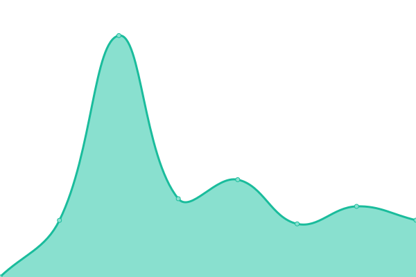

# [📈 Live Status](https://Kevin42IT.github.io/42Monitor): <!--live status--> **🟧 Partial outage**

This repository contains the open-source uptime monitor and status page for [Kevin42IT](https://Kevin42IT.github.io/42Monitor), powered by [Upptime](https://github.com/upptime/upptime).

With [Upptime](https://upptime.js.org), you can get your own unlimited and free uptime monitor and status page, powered entirely by a GitHub repository. We use [Issues](https://github.com/Kevin42IT/42Monitor/issues) as incident reports, [Actions](https://github.com/Kevin42IT/42Monitor/actions) as uptime monitors, and [Pages](https://Kevin42IT.github.io/42Monitor) for the status page.

<!--start: status pages-->
<!-- This summary is generated by Upptime (https://github.com/upptime/upptime) -->
<!-- Do not edit this manually, your changes will be overwritten -->
<!-- prettier-ignore -->
| URL | Status | History | Response Time | Uptime |
| --- | ------ | ------- | ------------- | ------ |
|  [pdg.ch](https://pdg.ch) | 🟩 Up | [pdg-ch.yml](https://github.com/Kevin42IT/42Monitor/commits/HEAD/history/pdg-ch.yml) | 

 1697ms
     
 | 

<a href="https://Kevin42IT.github.io/42Monitor/history/pdg-ch">100.00%</a>
    

|  [candy-factory.ch](https://candy-factory.ch) | 🟩 Up | [candy-factory-ch.yml](https://github.com/Kevin42IT/42Monitor/commits/HEAD/history/candy-factory-ch.yml) | 

 5380ms
     
 | 

<a href="https://Kevin42IT.github.io/42Monitor/history/candy-factory-ch">98.58%</a>
    

|  [vesperale.ch](https://vesperale.ch) | 🟩 Up | [vesperale-ch.yml](https://github.com/Kevin42IT/42Monitor/commits/HEAD/history/vesperale-ch.yml) | 

 2087ms
     
 | 

<a href="https://Kevin42IT.github.io/42Monitor/history/vesperale-ch">100.00%</a>
    

|  [cartigny.ch](https://cartigny.ch) | 🟩 Up | [cartigny-ch.yml](https://github.com/Kevin42IT/42Monitor/commits/HEAD/history/cartigny-ch.yml) | 

 1334ms
     
 | 

<a href="https://Kevin42IT.github.io/42Monitor/history/cartigny-ch">100.00%</a>
    

|  [mspg.ch](https://mspg.ch) | 🟩 Up | [mspg-ch.yml](https://github.com/Kevin42IT/42Monitor/commits/HEAD/history/mspg-ch.yml) | 

 1557ms
     
 | 

<a href="https://Kevin42IT.github.io/42Monitor/history/mspg-ch">100.00%</a>
    

|  [interacid-trading.com](https://interacid-trading.com) | 🟥 Down | [interacid-trading-com.yml](https://github.com/Kevin42IT/42Monitor/commits/HEAD/history/interacid-trading-com.yml) | 

 2251ms
     
 | 

<a href="https://Kevin42IT.github.io/42Monitor/history/interacid-trading-com">0.00%</a>
    

|  [veyrier.ch](https://veyrier.ch) | 🟩 Up | [veyrier-ch.yml](https://github.com/Kevin42IT/42Monitor/commits/HEAD/history/veyrier-ch.yml) | 

 1134ms
     
 | 

<a href="https://Kevin42IT.github.io/42Monitor/history/veyrier-ch">100.00%</a>
    

|  [orgapropre.ch](https://orgapropre.ch) | 🟩 Up | [orgapropre-ch.yml](https://github.com/Kevin42IT/42Monitor/commits/HEAD/history/orgapropre-ch.yml) | 

 1137ms
     
 | 

<a href="https://Kevin42IT.github.io/42Monitor/history/orgapropre-ch">100.00%</a>
    

|  [avully.ch](https://avully.ch) | 🟩 Up | [avully-ch.yml](https://github.com/Kevin42IT/42Monitor/commits/HEAD/history/avully-ch.yml) | 

 1263ms
     
 | 

<a href="https://Kevin42IT.github.io/42Monitor/history/avully-ch">99.71%</a>
    

|  [bodypass.ch](https://bodypass.ch) | 🟩 Up | [bodypass-ch.yml](https://github.com/Kevin42IT/42Monitor/commits/HEAD/history/bodypass-ch.yml) | 

 2895ms
     
 | 

<a href="https://Kevin42IT.github.io/42Monitor/history/bodypass-ch">100.00%</a>
    

|  [echami.ch](https://echami.ch) | 🟥 Down | [echami-ch.yml](https://github.com/Kevin42IT/42Monitor/commits/HEAD/history/echami-ch.yml) | 

 2275ms
     
 | 

<a href="https://Kevin42IT.github.io/42Monitor/history/echami-ch">0.29%</a>
    

|  [medlife.ch](https://medlife.ch) | 🟩 Up | [medlife-ch.yml](https://github.com/Kevin42IT/42Monitor/commits/HEAD/history/medlife-ch.yml) | 

 4025ms
     
 | 

<a href="https://Kevin42IT.github.io/42Monitor/history/medlife-ch">100.00%</a>
    

|  [immopassion.ch](https://immopassion.ch) | 🟩 Up | [immopassion-ch.yml](https://github.com/Kevin42IT/42Monitor/commits/HEAD/history/immopassion-ch.yml) | 

 1599ms
     
 | 

<a href="https://Kevin42IT.github.io/42Monitor/history/immopassion-ch">100.00%</a>
    

|  [metalu.ch](https://metalu.ch) | 🟩 Up | [metalu-ch.yml](https://github.com/Kevin42IT/42Monitor/commits/HEAD/history/metalu-ch.yml) | 

 1075ms
     
 | 

<a href="https://Kevin42IT.github.io/42Monitor/history/metalu-ch">100.00%</a>
    

|  [42it.ch](https://42it.ch) | 🟩 Up | [42it-ch.yml](https://github.com/Kevin42IT/42Monitor/commits/HEAD/history/42it-ch.yml) | 

 1247ms
     
 | 

<a href="https://Kevin42IT.github.io/42Monitor/history/42it-ch">100.00%</a>
    

|  [arveron.ch](https://arveron.ch) | 🟩 Up | [arveron-ch.yml](https://github.com/Kevin42IT/42Monitor/commits/HEAD/history/arveron-ch.yml) | 

 1439ms
     
 | 

<a href="https://Kevin42IT.github.io/42Monitor/history/arveron-ch">100.00%</a>
    

|  [csisimple.ch](https://csisimple.ch) | 🟩 Up | [csisimple-ch.yml](https://github.com/Kevin42IT/42Monitor/commits/HEAD/history/csisimple-ch.yml) | 

 1676ms
     
 | 

<a href="https://Kevin42IT.github.io/42Monitor/history/csisimple-ch">100.00%</a>
    

|  [ccinv.ch](https://ccinv.ch) | 🟩 Up | [ccinv-ch.yml](https://github.com/Kevin42IT/42Monitor/commits/HEAD/history/ccinv-ch.yml) | 

 915ms
     
 | 

<a href="https://Kevin42IT.github.io/42Monitor/history/ccinv-ch">100.00%</a>
    

|  [abcge.ch](https://abcge.ch) | 🟩 Up | [abcge-ch.yml](https://github.com/Kevin42IT/42Monitor/commits/HEAD/history/abcge-ch.yml) | 

 1089ms
     
 | 

<a href="https://Kevin42IT.github.io/42Monitor/history/abcge-ch">100.00%</a>
    

|  [athosfinearts.ch](https://athosfinearts.ch) | 🟩 Up | [athosfinearts-ch.yml](https://github.com/Kevin42IT/42Monitor/commits/HEAD/history/athosfinearts-ch.yml) | 

 1267ms
     
 | 

<a href="https://Kevin42IT.github.io/42Monitor/history/athosfinearts-ch">100.00%</a>
    

|  [dentistelancy.ch](https://dentistelancy.ch) | 🟩 Up | [dentistelancy-ch.yml](https://github.com/Kevin42IT/42Monitor/commits/HEAD/history/dentistelancy-ch.yml) | 

 2272ms
     
 | 

<a href="https://Kevin42IT.github.io/42Monitor/history/dentistelancy-ch">100.00%</a>
    

|  [secra.ch](https://secra.ch) | 🟩 Up | [secra-ch.yml](https://github.com/Kevin42IT/42Monitor/commits/HEAD/history/secra-ch.yml) | 

 2603ms
     
 | 

<a href="https://Kevin42IT.github.io/42Monitor/history/secra-ch">100.00%</a>
    

|  [3coqs.ch](https://3coqs.ch) | 🟩 Up | [3coqs-ch.yml](https://github.com/Kevin42IT/42Monitor/commits/HEAD/history/3coqs-ch.yml) | 

 1544ms
     
 | 

<a href="https://Kevin42IT.github.io/42Monitor/history/3coqs-ch">100.00%</a>
    

|  [airelaville.ch](https://airelaville.ch) | 🟩 Up | [airelaville-ch.yml](https://github.com/Kevin42IT/42Monitor/commits/HEAD/history/airelaville-ch.yml) | 

 2447ms
     
 | 

<a href="https://Kevin42IT.github.io/42Monitor/history/airelaville-ch">99.71%</a>
    

|  [gaechnerimmobilier.ch](https://gaechnerimmobilier.ch) | 🟩 Up | [gaechnerimmobilier-ch.yml](https://github.com/Kevin42IT/42Monitor/commits/HEAD/history/gaechnerimmobilier-ch.yml) | 

 1470ms
     
 | 

<a href="https://Kevin42IT.github.io/42Monitor/history/gaechnerimmobilier-ch">100.00%</a>
    

|  [actionfinance.ch](https://actionfinance.ch) | 🟩 Up | [actionfinance-ch.yml](https://github.com/Kevin42IT/42Monitor/commits/HEAD/history/actionfinance-ch.yml) | 

 3055ms
     
 | 

<a href="https://Kevin42IT.github.io/42Monitor/history/actionfinance-ch">100.00%</a>
    

|  [le-cigalon.ch](https://le-cigalon.ch) | 🟩 Up | [le-cigalon-ch.yml](https://github.com/Kevin42IT/42Monitor/commits/HEAD/history/le-cigalon-ch.yml) | 

 2123ms
     
 | 

<a href="https://Kevin42IT.github.io/42Monitor/history/le-cigalon-ch">100.00%</a>
    

|  [premiereligne.ch](https://premiereligne.ch) | 🟩 Up | [premiereligne-ch.yml](https://github.com/Kevin42IT/42Monitor/commits/HEAD/history/premiereligne-ch.yml) | 

 1946ms
     
 | 

<a href="https://Kevin42IT.github.io/42Monitor/history/premiereligne-ch">100.00%</a>
    

|  [nuit-blanche.ch](https://nuit-blanche.ch) | 🟩 Up | [nuit-blanche-ch.yml](https://github.com/Kevin42IT/42Monitor/commits/HEAD/history/nuit-blanche-ch.yml) | 

 1039ms
     
 | 

<a href="https://Kevin42IT.github.io/42Monitor/history/nuit-blanche-ch">100.00%</a>
    

|  [ge-emploi.ch](https://ge-emploi.ch) | 🟩 Up | [ge-emploi-ch.yml](https://github.com/Kevin42IT/42Monitor/commits/HEAD/history/ge-emploi-ch.yml) | 

 1083ms
     
 | 

<a href="https://Kevin42IT.github.io/42Monitor/history/ge-emploi-ch">100.00%</a>
    

|  [les-perouses.ch](https://les-perouses.ch) | 🟩 Up | [les-perouses-ch.yml](https://github.com/Kevin42IT/42Monitor/commits/HEAD/history/les-perouses-ch.yml) | 

 1452ms
     
 | 

<a href="https://Kevin42IT.github.io/42Monitor/history/les-perouses-ch">100.00%</a>
    

|  [okbag.ch](https://okbag.ch) | 🟩 Up | [okbag-ch.yml](https://github.com/Kevin42IT/42Monitor/commits/HEAD/history/okbag-ch.yml) | 

 1260ms
     
 | 

<a href="https://Kevin42IT.github.io/42Monitor/history/okbag-ch">100.00%</a>
    

|  [taxinitiative.southcentre.int](https://taxinitiative.southcentre.int) | 🟩 Up | [taxinitiative-southcentre-int.yml](https://github.com/Kevin42IT/42Monitor/commits/HEAD/history/taxinitiative-southcentre-int.yml) | 

 1373ms
     
 | 

<a href="https://Kevin42IT.github.io/42Monitor/history/taxinitiative-southcentre-int">100.00%</a>
    

|  [ameconscience.org](https://ameconscience.org) | 🟩 Up | [ameconscience-org.yml](https://github.com/Kevin42IT/42Monitor/commits/HEAD/history/ameconscience-org.yml) | 

 1970ms
     
 | 

<a href="https://Kevin42IT.github.io/42Monitor/history/ameconscience-org">100.00%</a>
    

|  [childlabourplatform.org](https://childlabourplatform.org) | 🟩 Up | [childlabourplatform-org.yml](https://github.com/Kevin42IT/42Monitor/commits/HEAD/history/childlabourplatform-org.yml) | 

 1952ms
     
 | 

<a href="https://Kevin42IT.github.io/42Monitor/history/childlabourplatform-org">100.00%</a>
    

|  [tacktack.ch](https://tacktack.ch) | 🟩 Up | [tacktack-ch.yml](https://github.com/Kevin42IT/42Monitor/commits/HEAD/history/tacktack-ch.yml) | 

 1308ms
     
 | 

<a href="https://Kevin42IT.github.io/42Monitor/history/tacktack-ch">100.00%</a>
    

|  [limani.ch](https://limani.ch) | 🟩 Up | [limani-ch.yml](https://github.com/Kevin42IT/42Monitor/commits/HEAD/history/limani-ch.yml) | 

 2069ms
     
 | 

<a href="https://Kevin42IT.github.io/42Monitor/history/limani-ch">100.00%</a>
    

|  [speiro.ch](https://speiro.ch) | 🟩 Up | [speiro-ch.yml](https://github.com/Kevin42IT/42Monitor/commits/HEAD/history/speiro-ch.yml) | 

 1039ms
     
 | 

<a href="https://Kevin42IT.github.io/42Monitor/history/speiro-ch">100.00%</a>
    

|  [tawaf.swiss](https://tawaf.swiss) | 🟩 Up | [tawaf-swiss.yml](https://github.com/Kevin42IT/42Monitor/commits/HEAD/history/tawaf-swiss.yml) | 

 1544ms
     
 | 

<a href="https://Kevin42IT.github.io/42Monitor/history/tawaf-swiss">100.00%</a>
    

|  [vidonne-system.ch](https://vidonne-system.ch) | 🟩 Up | [vidonne-system-ch.yml](https://github.com/Kevin42IT/42Monitor/commits/HEAD/history/vidonne-system-ch.yml) | 

 2318ms
     
 | 

<a href="https://Kevin42IT.github.io/42Monitor/history/vidonne-system-ch">100.00%</a>
    

|  [southcentre.int](https://southcentre.int) | 🟩 Up | [southcentre-int.yml](https://github.com/Kevin42IT/42Monitor/commits/HEAD/history/southcentre-int.yml) | 

 4354ms
     
 | 

<a href="https://Kevin42IT.github.io/42Monitor/history/southcentre-int">100.00%</a>
    

|  [pdainterim.ch](https://pdainterim.ch) | 🟩 Up | [pdainterim-ch.yml](https://github.com/Kevin42IT/42Monitor/commits/HEAD/history/pdainterim-ch.yml) | 

 1307ms
     
 | 

<a href="https://Kevin42IT.github.io/42Monitor/history/pdainterim-ch">100.00%</a>
    

|  [360swissengineering.ch](https://360swissengineering.ch) | 🟩 Up | [360swissengineering-ch.yml](https://github.com/Kevin42IT/42Monitor/commits/HEAD/history/360swissengineering-ch.yml) | 

 1178ms
     
 | 

<a href="https://Kevin42IT.github.io/42Monitor/history/360swissengineering-ch">100.00%</a>
    

|  [lucini.ch](https://lucini.ch) | 🟩 Up | [lucini-ch.yml](https://github.com/Kevin42IT/42Monitor/commits/HEAD/history/lucini-ch.yml) | 

 1191ms
     
 | 

<a href="https://Kevin42IT.github.io/42Monitor/history/lucini-ch">100.00%</a>
    

|  [uceticino.ch](https://uceticino.ch) | 🟩 Up | [uceticino-ch.yml](https://github.com/Kevin42IT/42Monitor/commits/HEAD/history/uceticino-ch.yml) | 

 1149ms
     
 | 

<a href="https://Kevin42IT.github.io/42Monitor/history/uceticino-ch">100.00%</a>
    

|  [cispi.ch](https://cispi.ch) | 🟩 Up | [cispi-ch.yml](https://github.com/Kevin42IT/42Monitor/commits/HEAD/history/cispi-ch.yml) | 

 1163ms
     
 | 

<a href="https://Kevin42IT.github.io/42Monitor/history/cispi-ch">100.00%</a>
    

|  [russin.ch](https://www.russin.ch) | 🟩 Up | [russin-ch.yml](https://github.com/Kevin42IT/42Monitor/commits/HEAD/history/russin-ch.yml) | 

 1332ms
     
 | 

<a href="https://Kevin42IT.github.io/42Monitor/history/russin-ch">99.72%</a>
    

|  [dent3d.ch](https://dent3d.ch) | 🟩 Up | [dent3d-ch.yml](https://github.com/Kevin42IT/42Monitor/commits/HEAD/history/dent3d-ch.yml) | 

 1307ms
     
 | 

<a href="https://Kevin42IT.github.io/42Monitor/history/dent3d-ch">100.00%</a>
    

|  [zeltner.consulting](https://zeltner.consulting) | 🟩 Up | [zeltner-consulting.yml](https://github.com/Kevin42IT/42Monitor/commits/HEAD/history/zeltner-consulting.yml) | 

 1560ms
     
 | 

<a href="https://Kevin42IT.github.io/42Monitor/history/zeltner-consulting">100.00%</a>
    

|  [daag.ch](https://daag.ch) | 🟩 Up | [daag-ch.yml](https://github.com/Kevin42IT/42Monitor/commits/HEAD/history/daag-ch.yml) | 

 1597ms
     
 | 

<a href="https://Kevin42IT.github.io/42Monitor/history/daag-ch">100.00%</a>
    

|  [pafmunication.ch](https://pafmunication.ch) | 🟩 Up | [pafmunication-ch.yml](https://github.com/Kevin42IT/42Monitor/commits/HEAD/history/pafmunication-ch.yml) | 

 1315ms
     
 | 

<a href="https://Kevin42IT.github.io/42Monitor/history/pafmunication-ch">100.00%</a>
    

|  [sortiesdeski.ch](https://sortiesdeski.ch) | 🟩 Up | [sortiesdeski-ch.yml](https://github.com/Kevin42IT/42Monitor/commits/HEAD/history/sortiesdeski-ch.yml) | 

 1174ms
     
 | 

<a href="https://Kevin42IT.github.io/42Monitor/history/sortiesdeski-ch">100.00%</a>
    

|  [mentharosset.ch](https://mentharosset.ch) | 🟩 Up | [mentharosset-ch.yml](https://github.com/Kevin42IT/42Monitor/commits/HEAD/history/mentharosset-ch.yml) | 

 2426ms
     
 | 

<a href="https://Kevin42IT.github.io/42Monitor/history/mentharosset-ch">100.00%</a>
    

|  [avusy.ch](https://avusy.ch) | 🟩 Up | [avusy-ch.yml](https://github.com/Kevin42IT/42Monitor/commits/HEAD/history/avusy-ch.yml) | 

 3072ms
     
 | 

<a href="https://Kevin42IT.github.io/42Monitor/history/avusy-ch">99.72%</a>
    

|  [troger.ch](https://troger.ch) | 🟩 Up | [troger-ch.yml](https://github.com/Kevin42IT/42Monitor/commits/HEAD/history/troger-ch.yml) | 

 3085ms
     
 | 

<a href="https://Kevin42IT.github.io/42Monitor/history/troger-ch">100.00%</a>
    

|  [moneyand.com](https://moneyand.com) | 🟩 Up | [moneyand-com.yml](https://github.com/Kevin42IT/42Monitor/commits/HEAD/history/moneyand-com.yml) | 

 1128ms
     
 | 

<a href="https://Kevin42IT.github.io/42Monitor/history/moneyand-com">100.00%</a>
    

|  [ss-int.com](https://ss-int.com) | 🟩 Up | [ss-int-com.yml](https://github.com/Kevin42IT/42Monitor/commits/HEAD/history/ss-int-com.yml) | 

 2597ms
     
 | 

<a href="https://Kevin42IT.github.io/42Monitor/history/ss-int-com">100.00%</a>
    

|  [zid.archi](https://zid.archi) | 🟩 Up | [zid-archi.yml](https://github.com/Kevin42IT/42Monitor/commits/HEAD/history/zid-archi.yml) | 

 1423ms
     
 | 

<a href="https://Kevin42IT.github.io/42Monitor/history/zid-archi">100.00%</a>
    

|  [covantis.io](https://covantis.io) | 🟩 Up | [covantis-io.yml](https://github.com/Kevin42IT/42Monitor/commits/HEAD/history/covantis-io.yml) | 

 772ms
     
 | 

<a href="https://Kevin42IT.github.io/42Monitor/history/covantis-io">100.00%</a>
    

|  [cydonia.swiss](https://cydonia.swiss) | 🟩 Up | [cydonia-swiss.yml](https://github.com/Kevin42IT/42Monitor/commits/HEAD/history/cydonia-swiss.yml) | 

 1073ms
     
 | 

<a href="https://Kevin42IT.github.io/42Monitor/history/cydonia-swiss">100.00%</a>
    

|  [fss-exfi.ch](https://fss-exfi.ch) | 🟩 Up | [fss-exfi-ch.yml](https://github.com/Kevin42IT/42Monitor/commits/HEAD/history/fss-exfi-ch.yml) | 

 1166ms
     
 | 

<a href="https://Kevin42IT.github.io/42Monitor/history/fss-exfi-ch">100.00%</a>
    

|  [ipaccessmeds.southcentre.int](https://ipaccessmeds.southcentre.int) | 🟩 Up | [ipaccessmeds-southcentre-int.yml](https://github.com/Kevin42IT/42Monitor/commits/HEAD/history/ipaccessmeds-southcentre-int.yml) | 

 1047ms
     
 | 

<a href="https://Kevin42IT.github.io/42Monitor/history/ipaccessmeds-southcentre-int">100.00%</a>
    

|  [fondationpav.ch](https://fondationpav.ch) | 🟩 Up | [fondationpav-ch.yml](https://github.com/Kevin42IT/42Monitor/commits/HEAD/history/fondationpav-ch.yml) | 

 1197ms
     
 | 

<a href="https://Kevin42IT.github.io/42Monitor/history/fondationpav-ch">100.00%</a>
    

<!--end: status pages-->

[**Visit our status website →**](https://Kevin42IT.github.io/42Monitor)

## 📄 License

- Powered by: [Upptime](https://github.com/upptime/upptime)
- Code: [MIT](./LICENSE) © [Kevin42IT](https://Kevin42IT.github.io/42Monitor)
- Data in the `./history` directory: [Open Database License](https://opendatacommons.org/licenses/odbl/1-0/)
